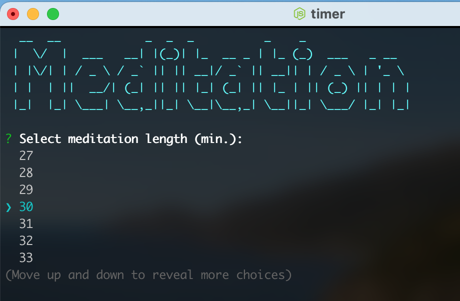
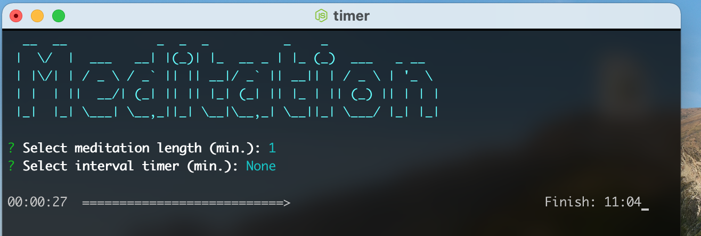

# Meditation Timer
 

Simple cli timer for meditation - or anything else.

### Install
Install via `npm install -g zen-timer` and then just call `timer`.

### Usage
You can set an interval timer; for example, it can ring every 10 minutes or in the middle of the session.
There's a progress bar and the time at the finish is presented:

## Todo

-   [X] Sounds.
-   [X] Intervals.
-   [X] Put on github.
-   [X] Learn to put on npm.
-   [ ] Optional: total time argument for faster starts.
-   [ ] Nicer colors overall.
