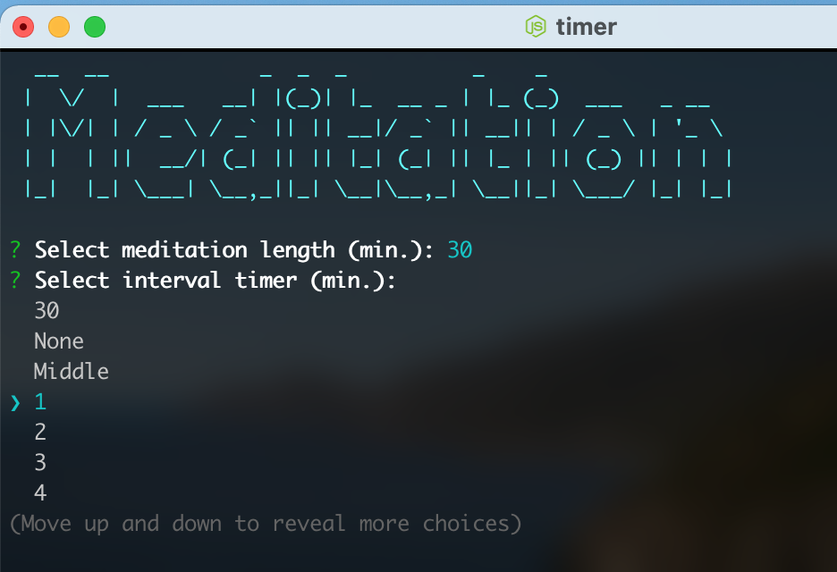

# Meditation Timer

Simple cli timer for meditation - or anything else.

Install via `npm install -g timer`.

You can set an interval timer; for example, it can ring every 10 minutes or in the middle of the session.

There's a progress bar and the time at the finish is presented:

## Todo

-   [X] Sounds.
-   [X] Intervals.
-   [ ] Put on github.
-   [ ] Optional total time argument for faster starts.
-   [ ] Learn to put on npm.
-   [ ] Nicer colors overall.
